# Web Stack Implementation (LAMP Stack) in AWS

This project will be focus on the LAMP Stack.

# What is a Technology stack?

Also called “solutions stack”, a technology stack consists of programming languages, frameworks, a database, front-end tools, back-end tools, and application connected via APIs.

There are different stack of technologies available: LAMP, LEMP, MERN, and MEAN. The right tech stack can help drive  a company’s product to success, making the product easier to build and ensuring it evolves alongside customer needs.

This project will be focus on the LAMP Stack in AWS.

## What is LAMP Stack?
LAMP (Linux, Apache, MySQL, PHP) is a proven set of software for delivering high-performance web applications. Each component contributes essential capabilities to the stack:
* Linux is the operating system. It is popular in part because it offers more flexibility and configuration options than some other operating systems.

* Apache is the web server which processes requests and serves up web assets via HTTP so that the application is accessible to anyone in the public domain over a simple web URL. 

* MySQL is an open source relational database management system for storing application data. It is also suitable for running even large and complex websites.

* PHP  is the programming language.  It is an open source scripting language that works with Apache to help developers create dynamic web pages. 

### Prerequisites

As the title indicates, this project will be deploy in the AWS Cloud platform.  An AWS account and a virtual server with Ubuntu Server OS must be created.
AWS is one the major Cloud Service Providers, and it provides a free virtual server called EC2 stands for Elastic Computer Cloud. These screenshots below will show the followings:

* Register a new AWS account

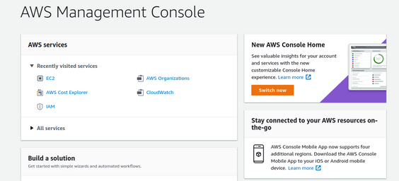

* Log In with email and password

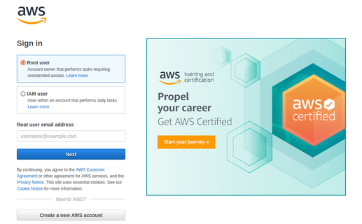

* Launch  a new EC2 Instance of t2.micro family with Ubuntu Server 20.04 LTS (HVM)

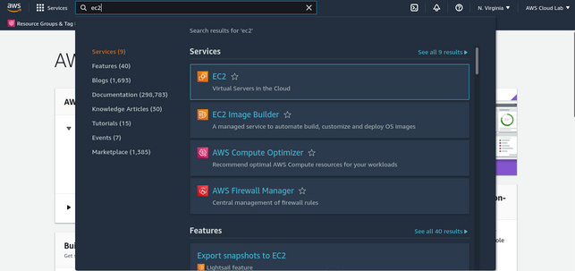

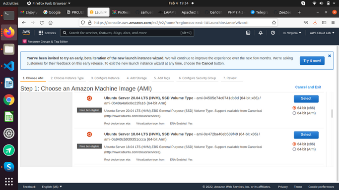

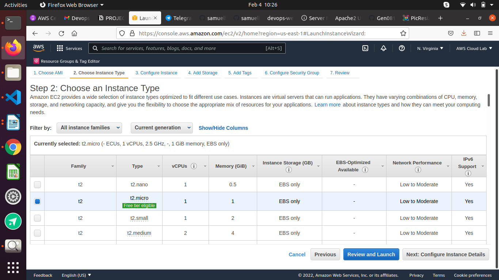

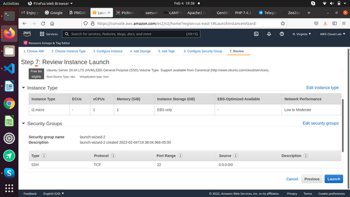

* Summary of the EC2 instance

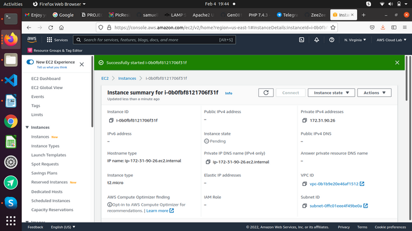

* Connecting local machine to EC2 instance

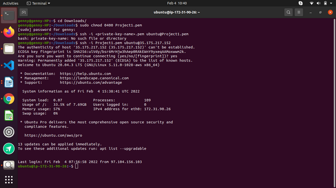

### Installing Apache

Install Apache using Ubuntu’s package manager ‘apt’:

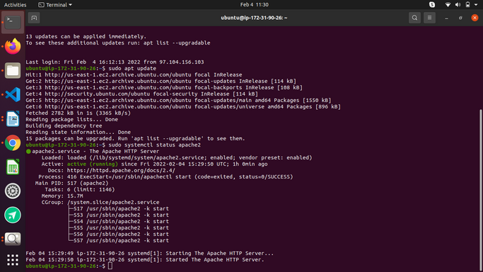

Before we can receive any traffic by our Web Server, we need to open TCP port 80, so we need to add a rule to EC2 configuration to open inbound connection through port 80:

The web server is now correctly installed and accessible through your firewall.

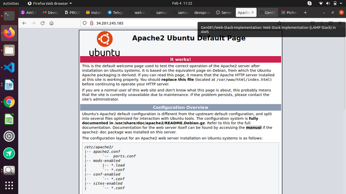

### Installing MySQL

As the web server is up and running, time to install a Database Management System (DBMS) to store and manage data for the website. With the PHP environment, MySQL is well suited.

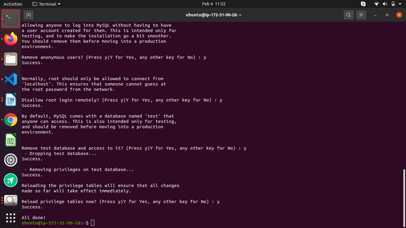

Log into the MySQL console

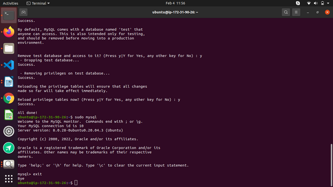

### Installing PHP

It is an open source scripting language that works with Apache to help developers create dynamic web pages. 

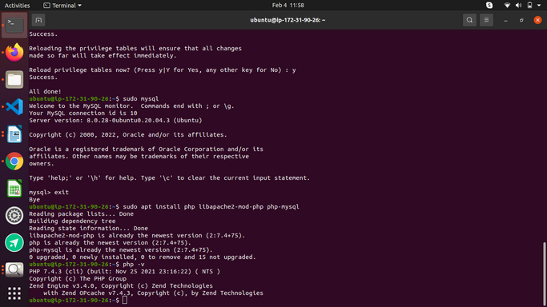

### Creating a Virtual Host 

This virtual host will be on the domain called projectlamp.

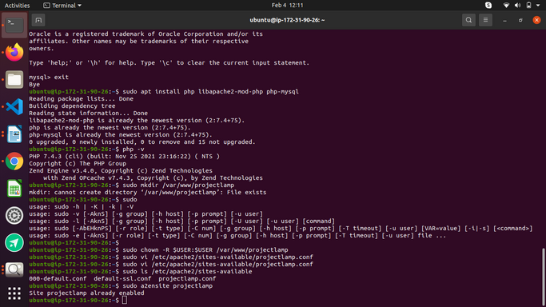 

A blank file is opened. Press the "i" keyboard to enter the insert mode and paste the below

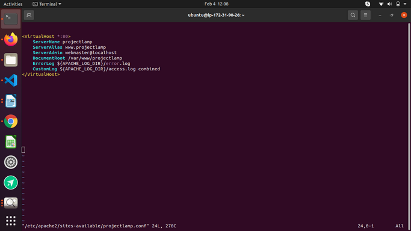 

To test the content in your browser

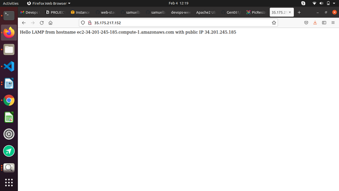 

## Enabling PHP

This directory index setting must be changed allowing PHP supersede the html file

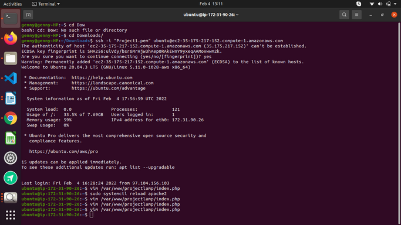

It is important to verify any changes made as follow:
refresh/reload your public ip address and the below should appear

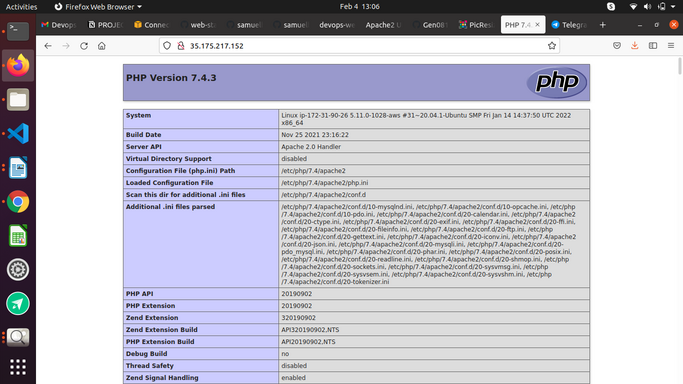

